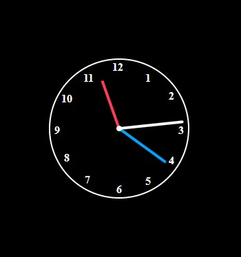

# Projetos Pessoais

Este repositório contém todos os projetos pessoais desenvolvidos com HTML5, CSS3 e JavaScript. Abaixo estão alguns dos projetos disponíveis:

## Calculadora de IMC (Índice de Massa Corporal)

Uma calculadora simples que permite ao usuário calcular seu Índice de Massa Corporal (IMC) com base no peso e altura fornecidos. O IMC é uma medida utilizada para avaliar se uma pessoa está com peso adequado em relação à sua altura.

## Calculadora Simples

Uma calculadora básica que realiza operações de adição, subtração, multiplicação e divisão. É uma ótima ferramenta para cálculos rápidos do dia a dia.

## Relógio Analógico

Um relógio simples que exibe as horas, minutos e segundos utilizando ponteiros. É uma implementação visualmente agradável e funcional de um relógio analógico.

Sinta-se à vontade para explorar os projetos e contribuir com novas ideias ou melhorias!
